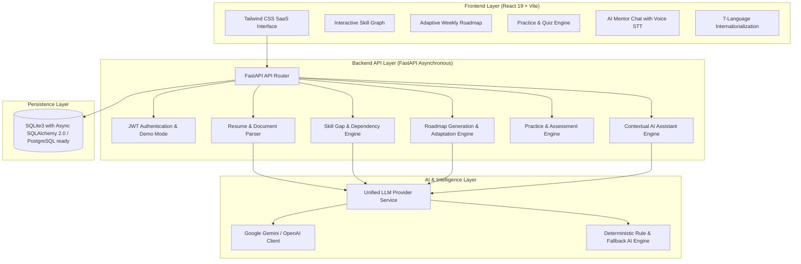
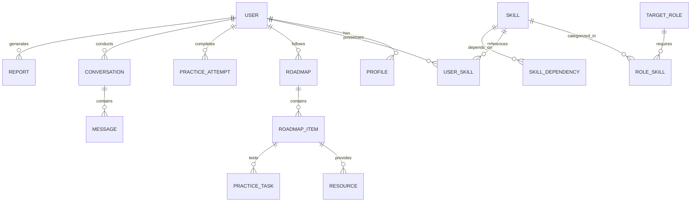

# EduPath — System Architecture & Technology Stack

## 1. System Overview

**EduPath** is an AI-powered personalized learning and skill-gap agent designed to transform how learners navigate career transitions and technical education. Rather than presenting a static catalog of generic tutorials, EduPath acts as an intelligent, dynamic mentor: it analyzes current learner competencies from resumes and project artifacts, benchmarks them against industry roles, computes categorized skill gaps, generates adaptive roadmaps, serves targeted practice and portfolio projects, and continually adapts based on learner struggle detection.

---

## 2. Technology Stack & Rationale

### Frontend: React 19 + Vite + Tailwind CSS + Lucide Icons
- **Choice:** React 19 with Vite, Tailwind CSS, Lucide Icons, and Canvas/SVG Graph Visualizations.
- **Rationale:** 
  - **Vite:** Sub-second Cold Start and instantaneous Hot Module Replacement (HMR) on Windows.
  - **Tailwind CSS:** Enables a sleek, modern design language (custom dark/light themes, typography, subtle glassmorphism, Linear/Vercel-level visual polish) without massive CSS bundle overhead.
  - **Native Canvas / SVG Skill Graph:** Renders interactive, zoomable dependency trees showing Mastered, In-Progress, Target, and Blocked skills without requiring bloated external canvas libraries.
  - **Web Speech API:** Built-in zero-latency speech-to-text with graceful browser fallback.

### Backend: Python 3.13 + FastAPI + Uvicorn
- **Choice:** FastAPI (asynchronous ASGI framework) powered by Uvicorn.
- **Rationale:**
  - **Native Async:** Handles concurrent I/O operations (document uploads, LLM streaming, database transactions) with minimal memory footprint.
  - **Pydantic v2:** Automatic data validation, OpenAPI specification generation, and type safety across endpoints.
  - **Rich Existing Ecosystem:** Leverages the user's pre-installed `fastapi`, `uvicorn`, `pypdf`, `openai`, `pytest` modules.

### Persistence: SQLAlchemy 2.0 (Async) + aiosqlite / PostgreSQL Ready
- **Choice:** SQLAlchemy 2.0 async engine with SQLite (`aiosqlite`) as default, configurable to PostgreSQL (`asyncpg`).
- **Rationale:**
  - **Zero Setup Friction:** SQLite requires no local database credentials, no port conflicts, and stores all learner data in a single local file (`edupath.db`).
  - **Enterprise Scalability:** Uses SQLAlchemy models and asynchronous sessions, allowing an instant drop-in switch to PostgreSQL simply by updating `DATABASE_URL` in `.env`.

### Document Parsing: PyPDF + Structured Text Extraction
- **Choice:** PyPDF + Pure Python DOCX / Text parser.
- **Rationale:** High-speed extraction of text from resumes, certificates, and portfolio documents without relying on external system binaries.

### AI Service Layer: Dual-Mode Architecture (LLM + Deterministic Engine)
- **Choice:** Abstraction layer with Gemini / OpenAI API integration + Comprehensive Deterministic Fallback Engine.
- **Rationale:**
  - When an API key (`GEMINI_API_KEY` or `OPENAI_API_KEY`) is present, calls stream from the state-of-the-art LLM with learner context.
  - When no key is provided, the platform **never breaks or fails**. It seamlessly runs the deterministic engine with realistic domain skills, skill trees, roadmaps, quizzes, and adaptive responses.

---

## 3. Core Database Schema Architecture

### Entity Descriptions
1. **User & Profile:** Authentication credentials, name, career goals, weekly available hours, preferred learning style, language.
2. **Skill & RoleSkill:** Master catalog of technical and soft competencies, taxonomy (Language, Framework, Tool, Concept), and benchmark role profiles (AI/ML Engineer, Full Stack Developer, DevOps/Cloud Engineer, Data Scientist, etc.).
3. **SkillGap:** Computed difference between user skills and target role requirements, tagged with priority (High, Medium, Low), gap type (Beginner, Intermediate, Advanced), and prerequisite dependencies.
4. **Roadmap & RoadmapItem:** Dynamic weekly schedules composed of learning objectives, estimated hours, and completion status.
5. **PracticeTask & PracticeAttempt:** Quizzes (MCQs), code challenges, and scenario tasks; records score, attempts, struggle flags, and time taken.
6. **AdaptiveLog:** Event-driven log recording weaknesses detected and dynamic adjustments made to the learner's roadmap.
7. **Conversation & Message:** Chat history with learner-context-aware system prompt.

---

## 4. Security & Error Handling

- **JWT Authentication:** Secure stateless access tokens with bcrypt/sha256 password hashing.
- **File Validation:** Size-restricted uploads (10 MB max), whitelist of `.pdf`, `.docx`, `.txt`.
- **CORS Management:** Configured for `http://localhost:5173` and `http://localhost:3000`.
- **Graceful Error Recovery:** HTTP error interceptors return clear, user-friendly feedback rather than raw 500 exceptions.
