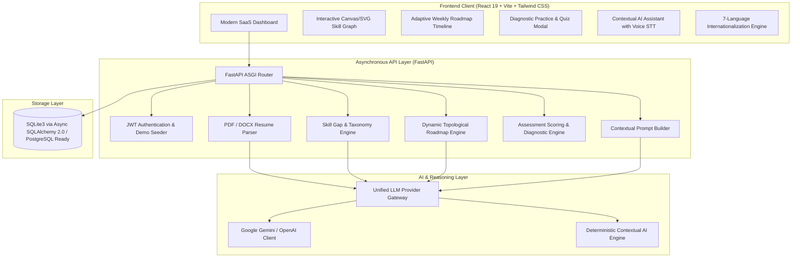

# 🚀 EduPath — AI-Powered Personalized Learning & Skill Gap Agent

[](https://opensource.org/licenses/MIT)
[](https://fastapi.tiangolo.com)
[](https://react.dev)
[](https://tailwindcss.com)
[](https://python.org)
[](https://nodejs.org)
[]()

> **Learn Smarter. Build Your Future.**  
> EduPath analyzes your current skills from resumes and projects, benchmarks you against modern industry roles, identifies categorized skill gaps, and dynamically builds an evolving learning journey with targeted practice, curated resources, and an AI mentor.

---

## 📌 The Core Problem

Learners know which career track or role they aspire to pursue (e.g., *AI/ML Engineer, Full Stack Developer, Data Scientist*), but face two critical barriers:
1. **Scattered Resources:** High-quality learning material is fragmented across courses, YouTube videos, official documentation, GitHub repositories, and coding sandboxes.
2. **Generic, Static Curriculums:** Most platforms force learners through repetitive, one-size-fits-all courses that ignore their existing proficiencies and fail to detect where they actually struggle.

---

## 💡 The EduPath Solution

EduPath treats technical learning as an **adaptive graph traversal**:
- **Automated Skill Extraction:** Parses PDF/DOCX resumes and project artifacts into an editable, structured profile.
- **Categorized Gap Analysis:** Compares competencies against role requirements, categorizing gaps into **Beginner** (unlearned concepts), **Intermediate** (partial knowledge), and **Advanced** (missing prerequisites).
- **Interactive Skill Dependency Graph:** Visualizes competencies and prerequisites as an interactive directed acyclic graph (DAG).
- **Dynamic Weekly Roadmap:** Topologically orders learning objectives according to available hours and prerequisite dependencies.
- **Adaptive Struggle Engine:** Monitors quiz attempts and accuracy. When low performance (<65%) is detected, EduPath automatically schedules supplementary revision modules before advancing.
- **Context-Aware AI Mentor:** Chatbot with voice speech-to-text (`🎤`) conditioned on the learner's actual profile, active week, and weak topics.
- **Multilingual Support:** Fully localized across **7 languages** (English, Hindi, Punjabi, Spanish, French, German, Japanese).
- **Zero-Friction Demo Mode:** Instant one-click exploration with pre-seeded learner **Alex Rivera (Aspiring AI/ML Engineer)** — no external API keys required!

---

## 🏗️ System Architecture



---

## ⚡ Key Features

| Feature | Description |
| :--- | :--- |
| **📄 Document Analysis** | Parses PDF/DOCX resumes with `pypdf` and XML parsers; displays an editable modal to add, edit, or remove extracted competencies before saving. |
| **🧠 Skill Gap Engine** | Benchmarks user against 5 industry roles (*AI/ML Engineer, Full Stack Developer, Data Scientist, DevOps, Cybersecurity*); categorizes gaps with priority, difficulty, and prerequisite dependencies. |
| **🗺️ Interactive Skill Graph** | Interactive SVG graph rendering Mastered (Green), In Progress (Blue), Target Gap (Yellow), and Blocked (Gray) nodes connected by prerequisite Bezier curves. |
| **📅 Personalized Roadmap** | Generates dynamic weekly milestones with objectives and curated resources (Official docs, YouTube courses, GitHub repositories). |
| **🎯 Diagnostic Practice** | Serves MCQs and coding challenges; provides immediate feedback, explanations, hints, and XP points. |
| **🔄 Adaptive Learning** | Automatically detects conceptual struggle (<65% accuracy) and dynamically schedules remedial revision modules into the active roadmap. |
| **💬 Contextual AI Mentor** | Chatbot that answers questions using the learner's actual profile, weak topics, and active goals. Supports **Speech-to-Text (`🎤`)** and markdown code blocks. |
| **🌍 Multilingual UI** | Switch between English, Hindi (हिन्दी), Punjabi (ਪੰਜਾਬੀ), Spanish (Español), French (Français), German (Deutsch), and Japanese (日本語). |
| **💼 Portfolio Generator** | Converts progress into real-world GitHub projects with auto-generated `README.md` files and resume bullets. |
| **📊 AI Progress Reports** | Formulates exportable weekly evaluations summarizing skills acquired, velocity, and recommended milestones. |
| **🎮 Tasteful Gamification** | XP points, daily streak flames, and milestone badges. |

---

## 💻 Tech Stack

### Frontend
- **Framework:** React 19 (Hooks, Context API)
- **Tooling:** Vite 6 (Sub-second HMR)
- **Styling:** Tailwind CSS 3.4 (Dark & Light modes, custom glassmorphism)
- **Icons:** Lucide React
- **Voice STT:** Browser Web Speech API with graceful typing fallback

### Backend
- **Framework:** FastAPI 0.135 (Python 3.13 asynchronous ASGI)
- **Database Engine:** SQLAlchemy 2.0 Async (`aiosqlite` default, `asyncpg` ready)
- **Validation:** Pydantic v2 & Pydantic Settings
- **Authentication:** JWT (HMAC-SHA256 tokens)
- **Document Processing:** PyPDF + Pure Python DOCX XML parser
- **Testing:** Pytest & HTTPX AsyncClient

---

## 📂 Project Structure

```text
edupath/
│
├── backend/
│   ├── app/
│   │   ├── api/             # FastAPI Endpoint Routers
│   │   │   ├── auth.py      # Registration, Login, Demo mode
│   │   │   ├── profile.py   # Learner preferences and settings
│   │   │   ├── documents.py # Resume & PDF upload and extraction
│   │   │   ├── skills.py    # Roles, skill gap analysis, graph
│   │   │   ├── roadmap.py   # Dynamic weekly milestones and items
│   │   │   ├── practice.py  # Diagnostic quizzes and assessments
│   │   │   ├── chat.py      # Context-aware AI mentor chat
│   │   │   └── reports.py   # Weekly AI reports and analytics
│   │   ├── models/          # SQLAlchemy 2.0 Async Models
│   │   ├── schemas/         # Pydantic v2 Request/Response Schemas
│   │   ├── services/        # Business Logic & Intelligence Engines
│   │   │   ├── adaptive_engine.py   # Struggle detection and roadmap adaptation
│   │   │   ├── ai_service.py        # Dual-mode LLM & deterministic fallback
│   │   │   ├── document_parser.py   # PDF & DOCX text extraction
│   │   │   ├── practice_engine.py   # Question bank & score calculation
│   │   │   ├── roadmap_engine.py    # Weekly topological scheduler
│   │   │   ├── skill_gap.py         # Role requirements & gap classifier
│   │   │   └── demo_seed.py         # Out-of-the-box demo learner seeder
│   │   ├── config.py        # Application settings and environment variables
│   │   ├── database.py      # Async SQLite / PostgreSQL session factory
│   │   └── main.py          # FastAPI application entry point
│   └── tests/               # Pytest Automated Test Suite
│
├── frontend/
│   ├── src/
│   │   ├── components/      # UI Components (Navbar, Sidebar, SkillGraph, ChatBot...)
│   │   ├── context/         # AuthContext, ThemeContext
│   │   ├── i18n/            # 7-Language translation dictionaries
│   │   ├── pages/           # Landing, Dashboard, SkillGap, Roadmap, Practice...
│   │   ├── App.jsx          # Root application coordinator
│   │   └── main.jsx         # React DOM entry point
│   ├── package.json
│   ├── tailwind.config.js
│   └── vite.config.js
│
├── scripts/                 # Batch and execution scripts
├── .env.example             # Environment configuration template
├── .gitignore               # Git ignore rules
├── ARCHITECTURE.md          # In-depth architectural documentation
├── ENVIRONMENT.md           # Machine specification and environment audit
├── README.md                # Project documentation
└── LICENSE                  # MIT License
```

---

## 🚀 Quick Start Guide

### Prerequisites
- **Python 3.10+** (Python 3.13 recommended)
- **Node.js LTS (v18+)** & **npm**
- **Git**

### 1. Clone the Repository
```bash
git clone https://github.com/manas0306-ops/edupath.git
cd edupath
```

### 2. Configure Environment
```bash
# Copy example environment configuration
cp .env.example .env
```
*(Optional: Add your `GEMINI_API_KEY` or `OPENAI_API_KEY` in `.env`. If left blank, EduPath runs in 100% functional offline deterministic mode!)*

### 3. Run the Application

#### Option A: One-Click Startup (Windows)
Double-click `run_all.bat` or execute in terminal:
```cmd
run_all.bat
```

#### Option B: Manual Startup
**Terminal 1 — Backend:**
```bash
python -m uvicorn backend.app.main:app --host 127.0.0.1 --port 8000 --reload
```

**Terminal 2 — Frontend:**
```bash
cd frontend
npm install
npm run dev
```

### 4. Access the Application
- **Frontend App:** [http://localhost:5173](http://localhost:5173)
- **Interactive Swagger API Docs:** [http://127.0.0.1:8000/docs](http://127.0.0.1:8000/docs)
- **ReDoc Documentation:** [http://127.0.0.1:8000/redoc](http://127.0.0.1:8000/redoc)

---

## 🧪 Automated Testing

EduPath features an automated asynchronous test suite verifying authentication, document analysis, skill gap resolution, roadmap generation, adaptive triggers, and chat mentor endpoints:

```bash
# Run backend pytest suite
python -m pytest backend/tests -p no:cacheprovider
```

Expected output:
```text
backend\tests\test_all_endpoints.py ....   [ 66%]
backend\tests\test_health.py ..            [100%]
======================== 6 passed in 5.70s ========================
```

To run the frontend production build check:
```bash
cd frontend
npm run build
```

---

## 🌟 Demo Walkthrough

1. **Launch App:** Navigate to `http://localhost:5173`.
2. **One-Click Demo:** Click **"Explore Interactive Demo"** on the landing page. This instantly authenticates as **Alex Rivera (Aspiring AI/ML Engineer)**.
3. **Explore Dashboard:** Observe the **28.5% Readiness** gauge, the 3-day active streak, daily learning goals, and the adaptive struggle notice for **SQL Joins**.
4. **Skill Gap Engine:** Click **Skill Gap Analysis** in the sidebar. Inspect the **Interactive Skill Prerequisite Map** with green mastered nodes, yellow target gaps, and gray locked nodes.
5. **Upload Resume:** Click **Upload Resume**, select any sample document or paste project text, and watch the NLP engine extract competencies with an editable confirmation modal.
6. **Roadmap & Practice:** Open **Personalized Roadmap**. Click **Practice Quiz** on PyTorch or SQL. Answer questions and view detailed pedagogical explanations and XP gains.
7. **Trigger Adaptive Learning:** If you miss a question or score low, notice the adaptive engine immediately schedule a supplementary revision module!
8. **AI Learning Mentor:** Open the AI Mentor. Ask *"What should I learn today?"* or click the microphone icon (`🎤`) to dictate your question using voice speech-to-text.
9. **Multilingual Switcher:** Select **हिन्दी, ਪੰਜਾਬੀ, Español, Français, Deutsch,** or **日本語** from the top bar to experience full application internationalization.
10. **Weekly Report:** Click **Progress Reports** to view your personalized weekly AI learning synthesis, ready to export or print.

---

## 📄 License

This project is licensed under the [MIT License](LICENSE).
